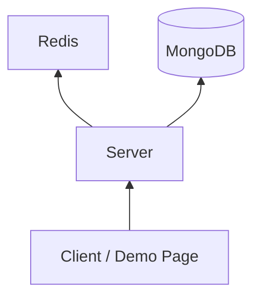

# krafton_jungle_mini-redis

FastAPI 기반 `Mini Redis` 구현 저장소다.  
KV 저장소, TTL, MongoDB cache-aside 데모, cache compare, 좌석 예약 동시성 시연을 포함한다.

## 문서
- [Project Spec](docs/spec/PROJECT_SPEC.md)
- [API Contract](docs/spec/API_CONTRACT.md)
- [System Design](docs/architecture/SYSTEM_DESIGN.md)
- [Test Strategy](docs/process/TEST_STRATEGY.md)

## 구조

## 구현 범위
- `SET`, `GET`, `DELETE`, `EXPIRE`, `TTL`
- lazy expiration
- MongoDB seeded data 기반 cache-aside demo
- cache hit / no-cache 성능 비교
- 좌석 예약 기반 동시성 시연
- 단일 HTML 데모 페이지

## 실행
```bash
python -m pip install -r requirements.txt
python scripts/seed_mongo.py
python -m uvicorn main:app --host 127.0.0.1 --port 8000
```

데모 페이지:

```text
http://127.0.0.1:8000/
```

## 주요 API
| Method | Path | Description |
|---|---|---|
| `POST` | `/kv` | key/value 저장 |
| `GET` | `/kv/{key}` | key 조회 |
| `DELETE` | `/kv/{key}` | key 삭제 |
| `POST` | `/kv/{key}/expire` | TTL 설정 |
| `GET` | `/kv/{key}/ttl` | TTL 조회 |
| `GET` | `/demo/data-cache` | MongoDB origin -> cache demo |
| `POST` | `/demo/performance/cache-compare` | cold vs warm cache 비교 |
| `POST` | `/demo/concurrency/seat-reservation` | 좌석 예약 동시성 시연 |

## 좌석 예약 동시성 시연
- 기본값은 `seatLimit = 50`, `requestCount = 100`
- 100개 요청은 동시에 시작되지만 실제 처리 로직은 single-thread executor가 직렬화한다
- 앞의 50개는 좌석을 배정받고, 이후 50개는 `soldOut`으로 종료된다
- timeline에서 순차 처리 순서와 결과를 바로 확인할 수 있다

예시 호출:

```bash
curl -X POST http://127.0.0.1:8000/demo/concurrency/seat-reservation ^
  -H "Content-Type: application/json" ^
  -d "{\"seatLimit\":50,\"requestCount\":100}"
```

CLI 시연:

```bash
python scripts/demo_concurrency.py
```

## 테스트
```bash
python -m pytest -q
```

## 성능 비교
```bash
python benchmarks/compare_cache.py --key sample --iterations 20
```
