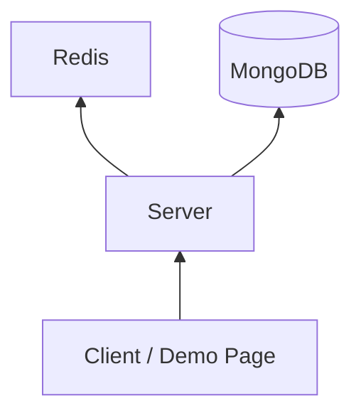

# krafton_jungle_mini-redis

FastAPI 기반 `Mini Redis` 구현 저장소다.  
인메모리 key/value 저장소, TTL, MongoDB 기반 cache-aside 데모, cache compare 벤치마크, 좌석 예약 동시성 시연을 포함한다.

## 문서 맵
- [Project Spec](docs/spec/PROJECT_SPEC.md)
- [API Contract](docs/spec/API_CONTRACT.md)
- [System Design](docs/architecture/SYSTEM_DESIGN.md)
- [Team Conventions](docs/process/TEAM_CONVENTIONS.md)
- [Test Strategy](docs/process/TEST_STRATEGY.md)
- [Workstream Plan](docs/planning/WORKSTREAM_PLAN.md)
- [Decision Log](docs/decisions/DECISION_LOG.md)
- [UI Demo Page Spec](docs/planning/UI_DEMO_PAGE_SPEC.md)

## 핵심 기능
- `SET`, `GET`, `DELETE`, `EXPIRE`, `TTL`
- lazy expiration 기반 TTL 처리
- MongoDB seeded dummy data 기반 cache-aside 데모
- cold origin vs warm cache 성능 비교
- single-thread command executor 기반 좌석 예약 동시성 시연
- 루트 경로(`/`)에서 제공하는 단일 HTML 데모 페이지

## 시스템 개요


## 서버 실행 방법
설치 및 실행:
```bash
python -m pip install -r requirements.txt
python scripts/seed_mongo.py
python -m uvicorn main:app --host 127.0.0.1 --port 8000
```

데모 페이지:
```text
http://127.0.0.1:8000/
```

## 환경 변수
| Name | Default | Description |
|---|---|---|
| `MINI_REDIS_MONGO_URI` | `mongodb://127.0.0.1:27017` | MongoDB 연결 URI |
| `MINI_REDIS_MONGO_DB` | `mini_redis` | MongoDB 데이터베이스 이름 |
| `MINI_REDIS_MONGO_COLLECTION` | `dummy_items` | 더미 데이터 컬렉션 이름 |
| `MINI_REDIS_DEFAULT_TTL_SECONDS` | `15` | cache demo 기본 TTL |

## 주요 API
| Method | Path | Description |
|---|---|---|
| `POST` | `/kv` | key/value 저장. 새 키면 `201`, 기존 키 갱신이면 `200` |
| `GET` | `/kv/{key}` | key 조회 |
| `DELETE` | `/kv/{key}` | key 삭제 |
| `POST` | `/kv/{key}/expire` | TTL 설정 |
| `GET` | `/kv/{key}/ttl` | TTL 조회 |
| `GET` | `/demo/data-cache` | MongoDB origin과 cache 흐름 시연 |
| `POST` | `/demo/performance/cache-compare` | cold origin vs warm cache 성능 비교 |
| `POST` | `/demo/concurrency/seat-reservation` | 좌석 예약 동시성 시연 |

모든 JSON 응답은 아래 envelope를 따른다.

```json
{
  "success": true,
  "data": {},
  "error": null
}
```

## 데모 시나리오
### KV + TTL
- `POST /kv`로 값을 저장한다.
- `POST /kv/{key}/expire`로 TTL을 설정한다.
- `GET /kv/{key}/ttl`로 남은 TTL을 확인한다.
- TTL이 만료되면 다음 조회 시 lazy expiration으로 키가 제거된다.

### Cache Demo
- `GET /demo/data-cache?key=sample` 첫 호출은 `source = origin`을 반환한다.
- TTL 이내 재호출은 `source = cache`를 반환한다.
- TTL 만료 뒤 다시 호출하면 `source = origin`으로 돌아간다.
- origin 결과가 비어 있으면 `items = []`를 반환하고 캐시하지 않는다.

### Seat Reservation Concurrency Demo
- 기본값은 `seatLimit = 50`, `requestCount = 100`이다.
- 요청은 동시에 시작되지만 실제 서비스 로직은 single-thread executor에서 순차 실행된다.
- 앞의 50개는 `reserved`, 이후 50개는 `soldOut`으로 종료된다.
- 응답의 `timeline`에서 `queueOrder`, `statusCode`, `seatNumber`, `durationMs`를 확인할 수 있다.

예시 호출:
```bash
curl -X POST http://127.0.0.1:8000/demo/concurrency/seat-reservation ^
  -H "Content-Type: application/json" ^
  -d "{\"seatLimit\":50,\"requestCount\":100}"
```

CLI 시연:
```bash
python scripts/demo_concurrency.py
```

## 테스트
```bash
python -m pytest -q
```

검증 범위:
- KV 저장/조회/삭제
- TTL 설정, 조회, 만료, lazy expiration
- cache-aside 흐름과 empty origin 미캐시 처리
- 성능 비교 응답 구조
- 좌석 예약 동시성 응답 구조와 직렬 처리 보장
- 루트 경로 HTML 데모 페이지 노출

## 벤치마크
```bash
python benchmarks/compare_cache.py --key sample --iterations 20
```

출력 항목:
- `api_cold_avg_ms`
- `api_warm_avg_ms`
- `api_saved_ms`
- `api_speedup_ratio`
- `service_cold_avg_ms`
- `service_warm_avg_ms`
- `service_saved_ms`
- `service_speedup_ratio`
