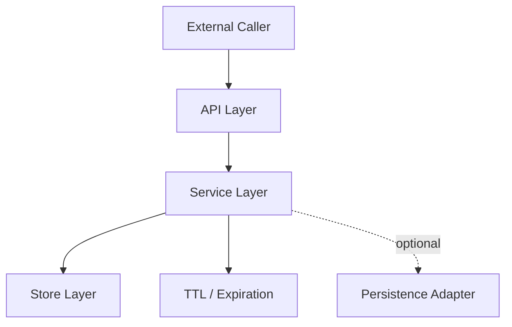

# System Design

이 문서는 시스템 구조, 계층 책임, 데이터 모델, 디렉터리 구조의 단일 원본이다. 구조적 판단은 이 문서를 기준으로 한다.

## 기본 구조
구현은 아래 3계층을 분리하는 방향으로 진행한다.



## 계층별 책임
- `API Layer`
  - 외부 입력을 받는다.
  - 요청을 서비스 호출로 변환한다.
  - HTTP 응답을 조립한다.
- `Service Layer`
  - 명령 의미를 해석한다.
  - TTL 규칙과 삭제 규칙을 적용한다.
  - 저장소 접근 순서를 통제한다.
- `Store Layer`
  - 키 조회, 저장, 삭제 primitive를 제공한다.
  - 값과 만료 메타데이터를 보관한다.

## 데이터 모델
권장 개념 구조:

```text
Map<Key, Entry>

Entry = {
  value,
  expiresAt | null
}
```

고정 규칙:
- `key`는 문자열
- `value`는 직렬화 가능한 값
- `expiresAt`이 없으면 만료 없음

## TTL 흐름
- 기본 정책은 `lazy expiration`
- 조회 또는 접근 시 먼저 만료 여부를 검사
- 만료되었으면:
  - 저장소에서 제거
  - 외부에는 miss로 반환
- 주기적 cleanup은 선택 과제

## 동시성 방향
- v1은 프로세스 내부 단일 저장소를 전제로 한다.
- 저장소를 직접 여러 곳에서 수정하지 않고, 서비스 계층을 유일한 진입 경로로 둔다.
- 명시적 동기화가 필요하면 가장 단순한 안전 장치를 택한다.
- 복잡한 락 전략을 먼저 도입하지 않는다.

## 권장 디렉터리 구조
기술 스택이 달라도 아래 구조에 최대한 대응되게 맞춘다.

```text
src/
  api/
  service/
  store/
  ttl/
  common/
tests/
  unit/
  integration/
benchmarks/
docs/
```

## 디렉터리 책임
- `src/api/`
  - HTTP 엔드포인트
  - 요청/응답 DTO
  - 에러 응답 매핑
- `src/service/`
  - 명령 처리 흐름
  - 공개 규칙 적용
  - 저장소와 TTL 조합
- `src/store/`
  - 해시 테이블 기반 저장 구조
  - key/value 엔트리 모델
  - 기본 set/get/delete primitive
- `src/ttl/`
  - 만료 시간 계산
  - 만료 검사
  - lazy expiration 처리
- `src/common/`
  - 공용 타입
  - 공용 에러
  - 공용 유틸
- `tests/unit/`
  - store, service, ttl 단위 테스트
- `tests/integration/`
  - HTTP API 기준 기능 테스트
- `benchmarks/`
  - 캐시 hit / no-cache 비교 코드

## 파일 배치 규칙
- API 코드는 `src/api/` 밖으로 새지 않는다.
- TTL 코드는 `src/ttl/` 또는 service 내부 협력 코드로만 위치한다.
- 저장소 내부 엔트리 구조는 `src/store/` 밖에서 직접 변경하지 않는다.
- 공용 타입은 반드시 `src/common/`에 모은다.
- 테스트 파일은 실제 코드 계층과 대응되도록 둔다.

## 작업 영역
- `store`
  - 저장 구조
  - key/value 보관
  - set/get/delete primitive
- `ttl`
  - expiresAt 계산
  - 만료 검사
  - lazy deletion
- `api`
  - 외부 인터페이스
  - 요청/응답 형식
  - 외부 API 캐싱 흐름
- `test-docs`
  - 단위 테스트
  - 기능 테스트
  - 벤치마크
  - README 반영

## 아키텍처 금지사항
- API 계층에서 TTL 판단을 하지 말 것
- 저장소 계층에서 외부 응답 형식을 만들지 말 것
- 영속성 로직을 핵심 저장 경로에 강하게 결합하지 말 것
- 선택 과제를 필수 구조처럼 선반영하지 말 것
