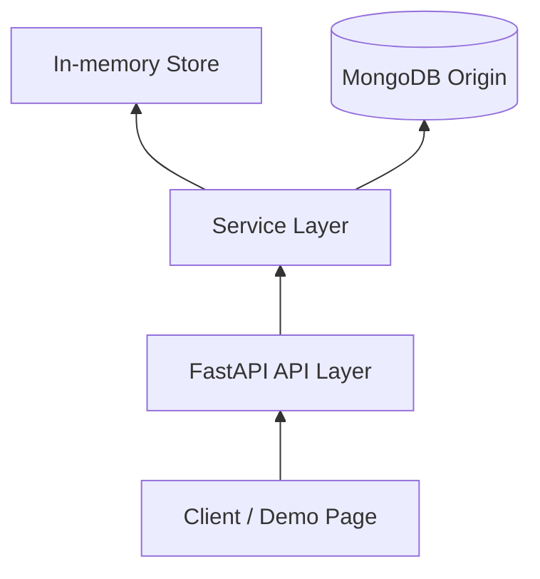

# System Design

이 문서는 시스템 구조와 계층 책임의 원본이다.

## 기본 구조

## 계층 책임
- `API Layer`
  - 요청 검증
  - 서비스 호출
  - HTTP 응답 구성
  - 예외를 공통 JSON envelope로 변환
- `Service Layer`
  - KV, TTL, cache-aside, benchmark, 좌석 예약 시연 규칙 적용
  - shared command executor를 통해 주요 명령 실행을 직렬화
- `Store Layer`
  - key/value 저장
  - expiration metadata 유지
- `Origin Adapter`
  - MongoDB `dummy_items` 조회

## 저장소 모델
- 기본 저장소는 인메모리 해시 테이블이다.
- 각 key는 `value`와 선택적 `expires_at` 메타데이터를 가진다.
- TTL 정보는 별도 백그라운드 스위퍼 없이 조회 시점에 평가한다.

## TTL 정책
- 기본 정책은 lazy expiration이다.
- 조회 또는 접근 시점에 만료 여부를 검사한다.
- 만료되었으면 저장소에서 제거하고 miss로 처리한다.
- 같은 key를 TTL 없이 다시 저장하면 기존 만료 정보는 제거한다.

## Command Execution Model
- v1은 단일 프로세스, 단일 shared command executor thread를 사용한다.
- KV, cache demo, seat reservation demo는 같은 executor를 공유한다.
- HTTP 요청 수신은 동시에 가능하지만 실제 서비스 로직은 executor에서 하나씩 순서대로 실행한다.
- 이 설계는 Redis식 직렬 명령 처리 모델을 단순화해 설명하기 위한 선택이다.

## Cache Demo Flow
1. API가 `GET /demo/data-cache` 요청을 받는다.
2. 서비스가 `data:{key}` 캐시 키를 계산한다.
3. 캐시 hit면 `source = cache`로 응답한다.
4. cache miss면 MongoDB origin을 조회한다.
5. 결과가 있으면 cache write 후 `source = origin`으로 응답한다.
6. 결과가 비어 있으면 empty `items`만 반환하고 캐시하지 않는다.

## Performance Compare Flow
1. API가 `POST /demo/performance/cache-compare` 요청을 받는다.
2. 서비스가 별도 benchmark app/context를 구성한다.
3. cold path는 매 반복마다 캐시를 비운 뒤 origin 응답 시간을 측정한다.
4. warm path는 한 번 priming한 뒤 cache 응답 시간을 측정한다.
5. API 기준 timing과 서비스 기준 timing을 각각 반환한다.

## Seat Reservation Demo Flow
1. 클라이언트가 `POST /demo/concurrency/seat-reservation`를 호출한다.
2. 서비스가 `requestCount`개의 작업을 거의 동시에 시작한다.
3. 각 작업은 executor에 예약 시도를 제출한다.
4. executor는 요청을 queue 순서대로 하나씩 처리한다.
5. 현재 예약 수가 `seatLimit` 미만이면 좌석 번호를 배정한다.
6. `seatLimit`에 도달한 뒤의 요청은 `soldOut`으로 종료한다.
7. 최종 응답은 집계 값과 전체 `timeline`을 포함한다.

## 디렉터리 책임
- `src/api/`
  - FastAPI 앱
  - 요청/응답 스키마
  - 공통 응답 포맷
  - 단일 HTML 데모 페이지
- `src/service/`
  - KV 서비스
  - cache demo 서비스
  - benchmark 서비스
  - seat reservation demo 서비스
  - MongoDB origin adapter
- `src/store/`
  - 인메모리 해시 테이블 저장소
- `src/ttl/`
  - 만료 시간 계산 및 검사
- `src/common/`
  - 공통 설정, 에러, validation, executor, seed data
