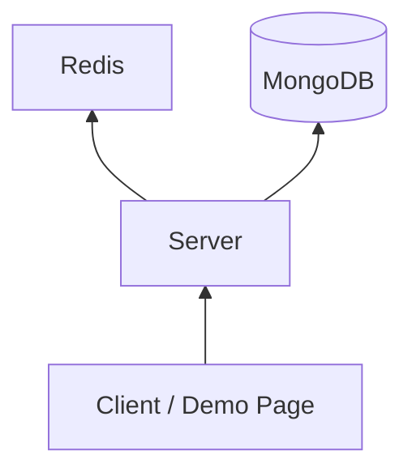

# System Design

이 문서는 시스템 구조와 계층 책임의 원본이다.

## 기본 구조

## 계층 책임
- `API Layer`
  - 요청 검증
  - 서비스 호출
  - HTTP 응답 구성
- `Service Layer`
  - KV, TTL, cache-aside, 좌석 예약 시연 규칙 적용
  - 모든 명령 실행을 single-thread executor로 직렬화
- `Store Layer`
  - key/value 저장
  - expiration metadata 유지
- `Origin Adapter`
  - MongoDB `dummy_items` 조회

## TTL 정책
- 기본 정책은 lazy expiration이다.
- 조회 또는 접근 시점에 만료 여부를 검사한다.
- 만료되었으면 저장소에서 제거하고 miss로 처리한다.

## Cache Demo Flow
1. API가 `GET /demo/data-cache` 요청을 받는다.
2. 서비스가 `data:{key}` 캐시 키를 계산한다.
3. 캐시 hit면 `source = cache`로 응답한다.
4. miss면 MongoDB origin을 조회한다.
5. 결과가 있으면 cache write 후 `source = origin`으로 응답한다.
6. 결과가 비어 있으면 empty `items`만 반환하고 캐시하지 않는다.

## Concurrency Model
- v1은 단일 프로세스, 단일 shared command executor thread를 사용한다.
- KV, cache demo, seat reservation demo 모두 같은 executor를 공유한다.
- HTTP 요청 수신은 동시에 가능하지만 실제 서비스 로직은 executor에서 하나씩 순서대로 실행한다.
- 좌석 예약 시연은 이 구조를 그대로 드러내는 데모다.

## Seat Reservation Demo Flow
1. 클라이언트가 `POST /demo/concurrency/seat-reservation`를 호출한다.
2. 서비스가 `requestCount`개의 요청 작업을 동시에 시작한다.
3. 각 작업은 executor에 예약 시도를 제출한다.
4. executor는 요청을 queue 순서대로 하나씩 처리한다.
5. 현재 예약 수가 `seatLimit` 미만이면 좌석 번호를 배정한다.
6. `seatLimit`에 도달한 뒤의 요청은 `soldOut`으로 종료한다.
7. 최종 응답은 reserved/soldOut 개수와 전체 timeline을 포함한다.

## 디렉터리 책임
- `src/api/`
  - HTTP 엔드포인트
  - 요청/응답 DTO
  - 단일 HTML 데모 페이지
- `src/service/`
  - KV 서비스
  - cache demo 서비스
  - seat reservation demo 서비스
  - performance benchmark 서비스
- `src/store/`
  - 인메모리 해시 테이블 저장소
- `src/ttl/`
  - 만료 시간 계산 및 검사
- `src/common/`
  - 공통 설정, 에러, 검증, executor
